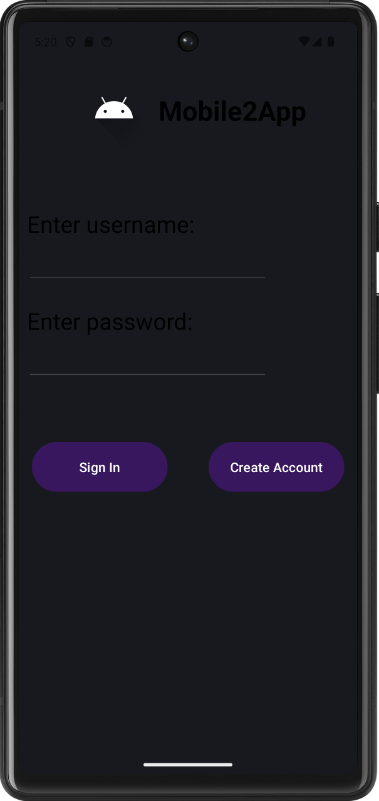
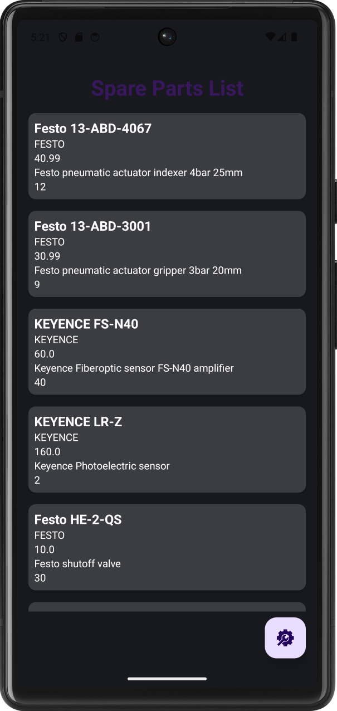

# CS360
## CS 360: Mobile Architecture and Programming

<table>
  <tr>
    <td><b>Login Page</b></td>
    <td><b>Main Inventory Page</b></td>
  </tr>
  <tr>
    <td></td>
    <td></td>
  </tr>
</table>

### Spare Parts Inventory App - Reflection

The development of this app followed a similar pattern to other projects that were job related - find a problem at work, then try and solve it (or at least make it better lol). In this case the problem I was trying to solve was our convoluted way of ordering and tracking spare parts in the robotics/manufacturing space. The goal of the application was to provide a simple, reliable way for users to track and manage parts data on a mobile device. The app was designed to address the needs of small team of automation technicians who require quick access to inventory information without relying on cloud systems or complex enterprise tools. To meet these needs, the application implemented local **SQLite** databases for **persistent storage** of both user credentials and inventory records. Core requirements included secure login, the ability to create, view, update, and delete inventory items, and retention of all data between sessions. By focusing on offline capability and straightforward data entry, the app delivered a practical solution aligned with real-world inventory tracking workflows.

Several screens and features were necessary to support these user needs and maintain a **Android** compliant interface. The login screen ensured controlled access and protected stored data, while the main inventory screen displayed parts in a structured, scrollable list using **RecyclerView** for pleasurable presentation. Dialog-based add and edit interactions minimized navigation complexity and kept users within context while performing **CRUD** operations. UI decisions prioritized clarity and efficiency: labeled fields matched inventory terminology, item layouts mirrored tabular data users expect in tracking systems, and actions were accessible through familiar mobile patterns such as floating action buttons. These choices were successful because they reduced cognitive load and allowed users to focus on managing data rather than learning the interface.

The development process followed a layered architecture using SQLite with a **Repository pattern aligned to an MVC-style separation of concerns**. Database helpers handled schema and persistence, repositories mediated data access, adapters connected data to UI components, and activities controlled interaction flow. Coding proceeded incrementally with building authentication first, then database operations, then UI binding independently to verify correctness. Functional testing included validating CRUD operations, confirming database persistence across app restarts, and ensuring CSV-based initial data loading populated the inventory correctly. This process revealed integration issues early (such as data not appearing due to loading errors) and reinforced the importance of tracing data across storage, model, and UI layers. A key innovation occurred in designing the initial inventory seeding and adapter-driven interactive list, which demonstrated strong understanding of Android data flow. Overall, the project successfully showcased skills in mobile architecture, databases, and user-focused interface design, which provides me with a solid foundation for future Android development work.

